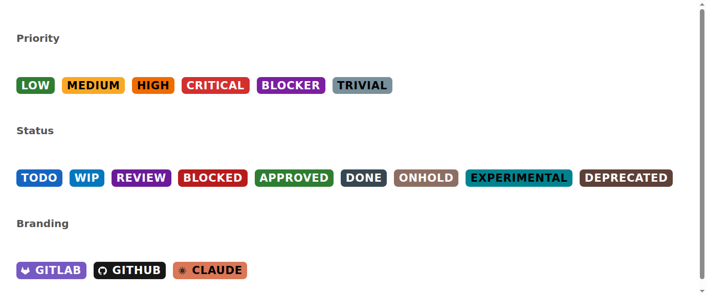

# Badge catalogue

Ready-to-paste `levels` entries, grouped by what they are for. Copy the block you want into your config, under `[project.markdown_extensions.markdown_priority_badges.levels]` (Zensical / MkDocs TOML) or into the `levels` dict (plain Python-Markdown).

Generated by `scripts/gen_badges.py`. Edit the `CATALOGUE` there and re-run `uv run python scripts/gen_badges.py` rather than editing this file.



> [!NOTE]
> Only `low`, `medium`, `high`, and `critical` ship as built-ins. Everything else here is config you add. Order matters for `priority_of`: a level's rank is its position in the map.

## Priority

| Keyword | Base | Text | Notes |
| --- | --- | --- | --- |
| `!low` | `#2e7d32` | `#fff` | Built-in. Green. |
| `!medium` | `#f9a825` | `#000` | Built-in. Amber. |
| `!high` | `#ef6c00` | `#000` | Built-in. Orange. Also the `!` shorthand. |
| `!critical` | `#d32f2f` | `#fff` | Built-in. Red. Also the `!!` shorthand. |
| `!blocker` | `#7b1fa2` | `#fff` | Above critical: work that cannot start. |
| `!trivial` | `#78909c` | `#000` | Below low: nice to have. |

```toml
[project.markdown_extensions.markdown_priority_badges.levels]
low = "#2e7d32"
medium = "#f9a825"
high = "#ef6c00"
critical = "#d32f2f"
blocker = "#7b1fa2"
trivial = "#78909c"
```

## Status

| Keyword | Base | Text | Notes |
| --- | --- | --- | --- |
| `!todo` | `#1565c0` | `#fff` | Not started. |
| `!wip` | `#0277bd` | `#fff` | In progress. |
| `!review` | `#6a1b9a` | `#fff` | Waiting on a reviewer. |
| `!blocked` | `#b71c1c` | `#fff` | Waiting on someone else. |
| `!approved` | `#2e7d32` | `#fff` | Signed off, not yet shipped. |
| `!done` | `#37474f` | `#fff` | Finished. |
| `!onhold` | `#8d6e63` | `#fff` | Paused on purpose. |
| `!experimental` | `#00838f` | `#000` | Not stable yet. |
| `!deprecated` | `#5d4037` | `#fff` | On the way out. |

```toml
[project.markdown_extensions.markdown_priority_badges.levels]
todo = "#1565c0"
wip = "#0277bd"
review = "#6a1b9a"
blocked = "#b71c1c"
approved = "#2e7d32"
done = "#37474f"
onhold = "#8d6e63"
experimental = "#00838f"
deprecated = "#5d4037"
```

## Branding

| Keyword | Base | Text | Notes |
| --- | --- | --- | --- |
| `!gitlab` | `#7759c2` | `#fff` | GitLab purple, white tanuki. |
| `!github` | `#181717` | `#fff` | GitHub near-black, white mark. |
| `!claude` | `#d97757` | `#000` | Claude coral, dark starburst. |

```toml
[project.markdown_extensions.markdown_priority_badges.levels]
gitlab = "#7759c2;background-image:url('data:image/svg+xml,%3Csvg%20xmlns%3D%27http%3A%2F%2Fwww.w3.org%2F2000%2Fsvg%27%20viewBox%3D%270%200%2024%2024%27%20fill%3D%27%23fff%27%3E%3Cpath%20d%3D%27M23.955%2013.587l-1.342-4.135-2.664-8.189a.455.455%200%2000-.867%200L16.418%209.45H7.582L4.919%201.263a.455.455%200%2000-.867%200L1.386%209.45.044%2013.587a.924.924%200%2000.331%201.03L12%2023.054l11.625-8.436a.92.92%200%2000.33-1.031%27%2F%3E%3C%2Fsvg%3E');background-repeat:no-repeat;background-position:0.45em center;background-size:0.8em;padding-left:1.75em"
github = "#181717;background-image:url('data:image/svg+xml,%3Csvg%20xmlns%3D%27http%3A%2F%2Fwww.w3.org%2F2000%2Fsvg%27%20viewBox%3D%270%200%2024%2024%27%20fill%3D%27%23fff%27%3E%3Cpath%20d%3D%27M12%20.297c-6.63%200-12%205.373-12%2012%200%205.303%203.438%209.8%208.205%2011.385.6.113.82-.258.82-.577%200-.285-.01-1.04-.015-2.04-3.338.724-4.042-1.61-4.042-1.61C4.422%2018.07%203.633%2017.7%203.633%2017.7c-1.087-.744.084-.729.084-.729%201.205.084%201.838%201.236%201.838%201.236%201.07%201.835%202.809%201.305%203.495.998.108-.776.417-1.305.76-1.605-2.665-.3-5.466-1.332-5.466-5.93%200-1.31.465-2.38%201.235-3.22-.135-.303-.54-1.523.105-3.176%200%200%201.005-.322%203.3%201.23.96-.267%201.98-.399%203-.405%201.02.006%202.04.138%203%20.405%202.28-1.552%203.285-1.23%203.285-1.23.645%201.653.24%202.873.12%203.176.765.84%201.23%201.91%201.23%203.22%200%204.61-2.805%205.625-5.475%205.92.42.36.81%201.096.81%202.22%200%201.606-.015%202.896-.015%203.286%200%20.315.21.69.825.57C20.565%2022.092%2024%2017.592%2024%2012.297c0-6.627-5.373-12-12-12%27%2F%3E%3C%2Fsvg%3E');background-repeat:no-repeat;background-position:0.45em center;background-size:0.8em;padding-left:1.75em"
claude = "#d97757;background-image:url('data:image/svg+xml,%3Csvg%20xmlns%3D%27http%3A%2F%2Fwww.w3.org%2F2000%2Fsvg%27%20viewBox%3D%270%200%2024%2024%27%20fill%3D%27%231f1e1d%27%3E%3Cpath%20d%3D%27M13.03%2011.00L12.57%201.00L11.43%201.00L10.97%2011.00ZM13.40%2011.71L18.43%203.06L17.46%202.44L11.68%2010.60ZM13.34%2012.52L22.24%207.95L21.77%206.91L12.48%2010.65ZM12.84%2013.16L22.81%2014.13L22.97%2013.00L13.14%2011.13ZM12.08%2013.43L19.94%2019.64L20.69%2018.77L13.43%2011.88ZM11.30%2013.25L14.55%2022.72L15.65%2022.39L13.27%2012.67ZM10.73%2012.67L8.35%2022.39L9.45%2022.72L12.70%2013.25ZM10.57%2011.88L3.31%2018.77L4.06%2019.64L11.92%2013.43ZM10.86%2011.13L1.03%2013.00L1.19%2014.13L11.16%2013.16ZM11.52%2010.65L2.23%206.91L1.76%207.95L10.66%2012.52ZM12.32%2010.60L6.54%202.44L5.57%203.06L10.60%2011.71Z%27%2F%3E%3C%2Fsvg%3E');background-repeat:no-repeat;background-position:0.45em center;background-size:0.8em;padding-left:1.75em"
```

## Adding a branding badge

Take the logo as a single-path SVG and add its `d` attribute to `ICONS` in `scripts/gen_badges.py`, then add a `Badge(..., icon="<key>")` entry to `CATALOGUE`. The script URL-encodes the SVG and builds the `data:` URI, so the badge costs no network request.

Pick the base color and the icon fill together. The badge text color is chosen automatically from the base, so a white mark needs a base dark enough to resolve to white text, and a dark mark needs a light one. The **Text** column above shows what each base resolves to.
